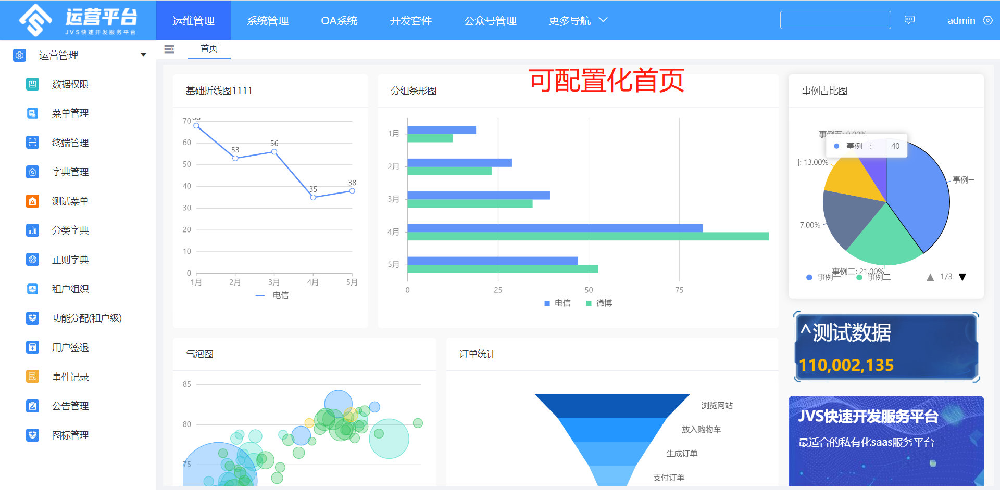
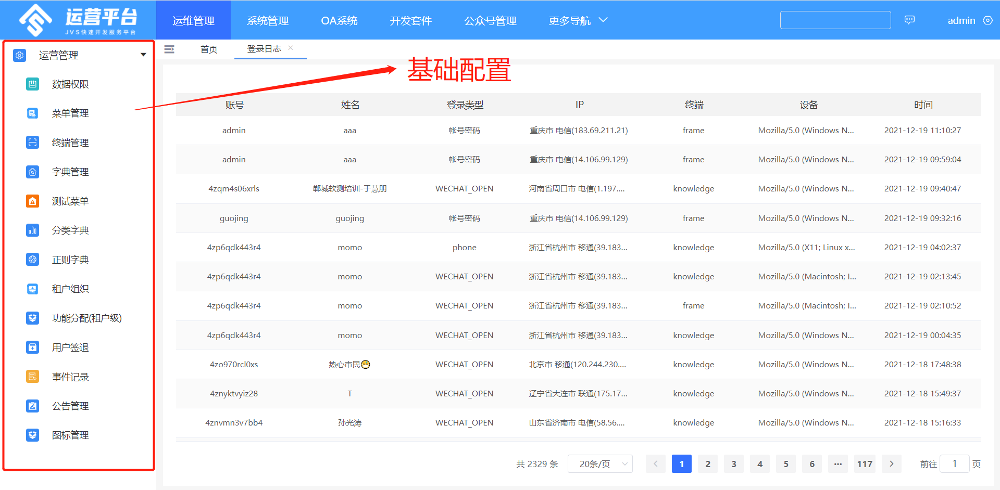
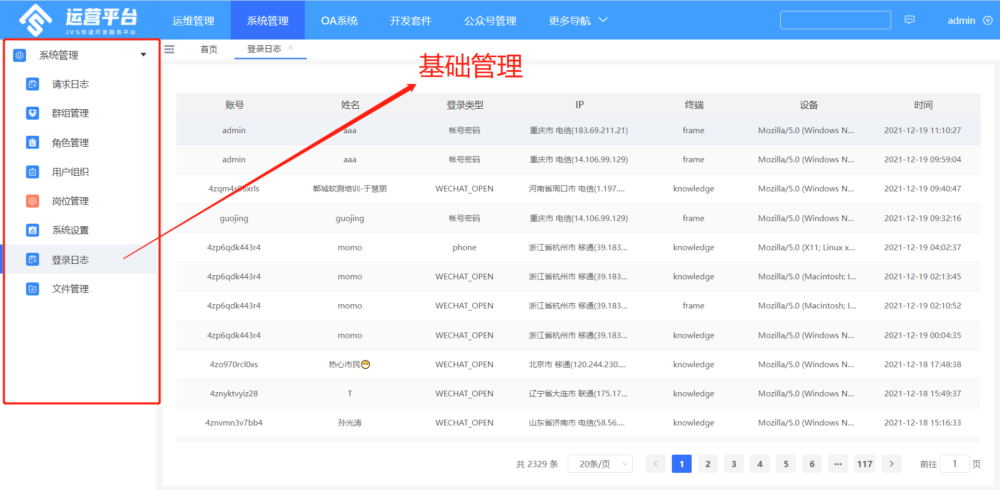
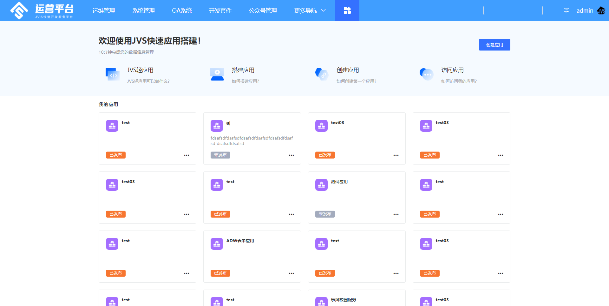
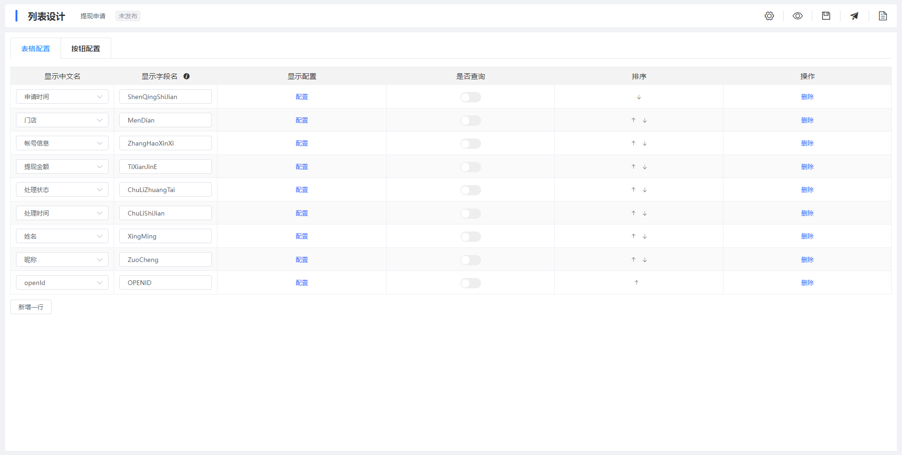
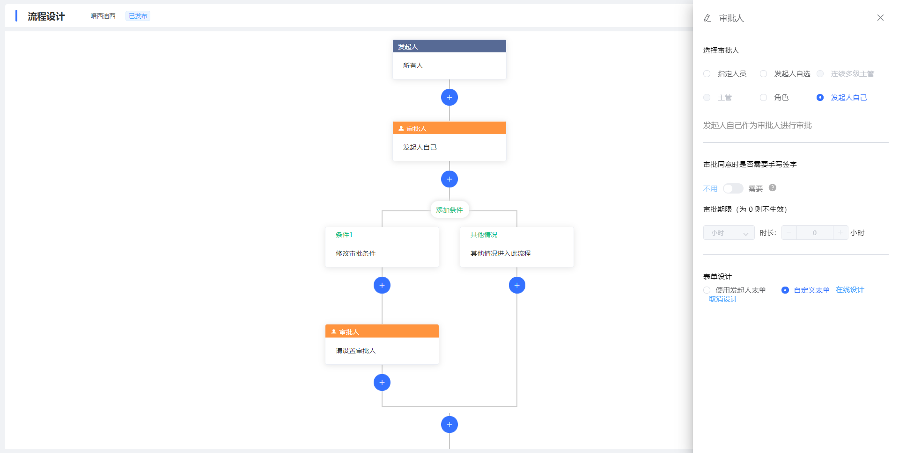
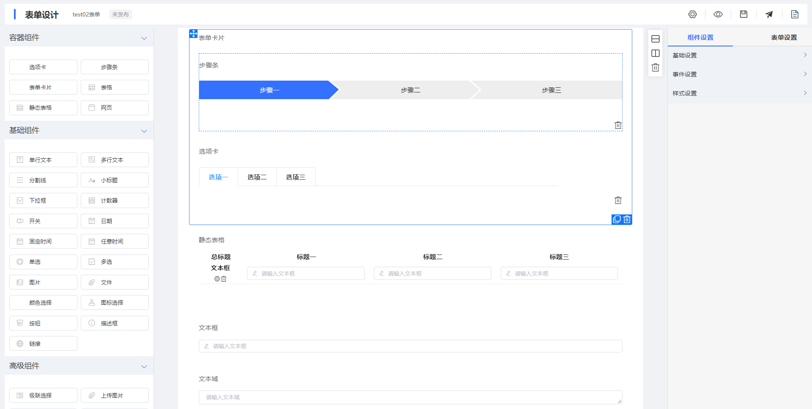
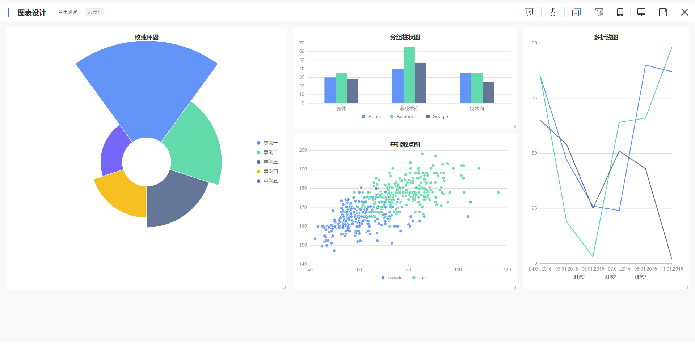
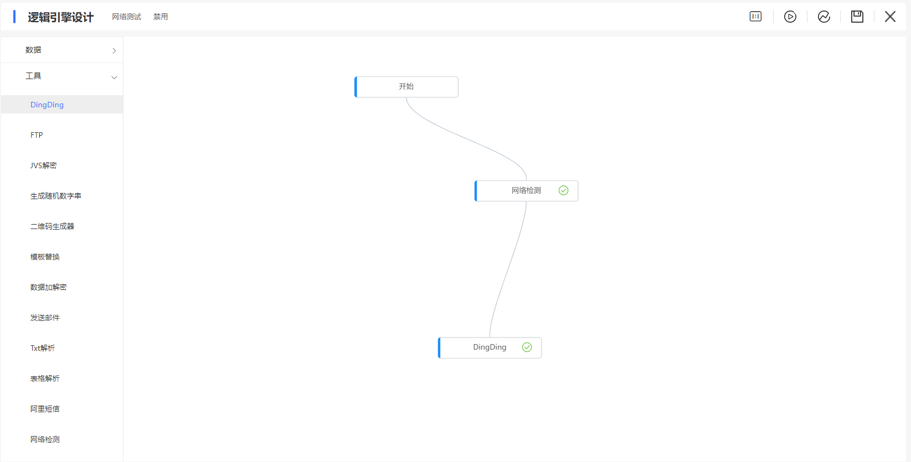

## **项目介绍：**

- **JVS的核心目标：**让中小型开发团队过得轻松一点，优化开发团队人力成本高、交付效率低、质量不可控、周期不确定、基础技术投入不足、高端技术支持不够等
- JVS是面向软件开发团队可以快速实现应用的基础开发框架，采用微服务分布式框架，提供丰富的基础功能，集成众多业务引擎，它灵活性强，界面化配置对开发者友好，底层容器化构建，集合持续化构建。

## **项目标签**

低代码、微服务、支持SaaS、私有化部署、DevOps、

## **项目构成**

- 框架前端地址：https://github.com/RKQF-JVS/jvs-ui
- 框架后端地址：https://github.com/RKQF-JVS/jvs

## **体验地址**

开源协议：详见license

**体验地址：http://frame.bctools.cn/#/login**

登陆可以通过微信扫码登陆，对于配置数据，请各位技术同学手下留情。

### 部署文档

https://github.com/RKQF-JVS/jvs-docker-compose/blob/master/readme.md

**物理拓扑：

**技术文档地址（微信登陆可查看）：**

**技术栈说明：**

|                | **组件名称**                               | **组件作用**     | **开源协议** |      |
| -------------- | ------------------------------------------ | ---------------- | ------------ | ---- |
| 表现层（前端） | EsLint                                     | 前端代码质量检测 | MIT          |      |
| Vuex           | 前端框架                                   | MIT              |              |      |
| Element-ui     | 前端组件库                                 | MIT              |              |      |
| Crypto-Js      | 前端加密                                   | BSD              |              |      |
| axios          | 基于promise用于浏览器和node.js的http客户端 | MIT              |              |      |
| data-set       | 前端数据绑定                               | MIT              |              |      |
| vue-router     | 前端路由                                   | MIT              |              |      |
| v-charts       | 图形化组件渲染                             | MIT              |              |      |
| E-charts       | 图形化组件渲染                             | Apache 2.0       |              |      |
| WebPack        | 前端代码打包                               | MIT              |              |      |
| G2             | 图形化组件渲染                             | MIT              |              |      |
| G6             | 图形化组件渲染                             | MIT              |              |      |
|                |                                            |                  |              |      |

| **组件归属**           | **组件名称**   | **组件作用**      | **开源协议** |      |
| ---------------------- | -------------- | ----------------- | ------------ | ---- |
| 应用逻辑层（后端框架） | Lombok         | 代码精简          | MIT          |      |
| Mybatis plus           | 数据持久层     | Apache 2.0        |              |      |
| Hutool                 | 底层工具集     | 木兰宽松许可证 V2 |              |      |
| Swagger                | 在线接口文档   | Apache 2.0        |              |      |
| Groovy                 | 敏捷脚本语言   | Apache 2.0        |              |      |
| Spring boot            | 基础脚手架     | Apache 2.0        |              |      |
| spring cloud alibaba   | 微服务框架     | Apache 2.0        |              |      |
| Xxl-job                | 定时任务       | GNU 3.0           | 通过端口调用 |      |
| Nacos                  | 注册中心       | Apache 2.0        |              |      |
| Sentinel               | 接口限流       | Apache 2.0        |              |      |
| seata                  | 分布式事务处理 | Apache 2.0        |              |      |
| Skywalking             | 链路跟踪       | Apache 2.0        |              |      |
| Redisson               | 分布式锁       | Apache 2.0        |              |      |
| RabbitMq               | 消息队列       | MPL 1.1           |              |      |
| Kafka                  | 分布式消息队列 | Apache 2.0        |              |      |

| **组件归属** | **组件名称**            | **组件作用**                 | **开源协议** |      |
| ------------ | ----------------------- | ---------------------------- | ------------ | ---- |
| 数据存储层   | ElasticSearch           | 文件搜索引擎（日志、打文本） | Apache 2.0   |      |
| Mongo        | 分布式文件存储数据库    | Apache 2.0                   |              |      |
| Mysql        | 关系型数据库            | GPL                          | 通过端口调用 |      |
| MariaDB      | MYSQL集群               | GNU 2.0                      | 通过端口调用 |      |
| mycat        | 数据分库                |                              |              |      |
| Redis        | 高性能的key-value数据库 | BSD 3                        |              |      |

| **组件归属** | **组件名称** | **组件作用** | **开源协议** |      |
| ------------ | ------------ | ------------ | ------------ | ---- |
| 运维支持层   | Docker       | 容器         | Apache 2.0   |      |
|              |              |              |              |      |

## **系统部分截图：**
### 登陆页面

### 配置化首页

### 系统基础信息设置

### 框架基础功能

### 应用创建（）

### 列表配置

### 流程配置

### 表单配置

### 图表配置

### 逻辑配置

### 使用与授权
在合规备案情况下，支持自用与商用，商用提供100%源代码。
### 版本说明：
使用用途|费用模式|使用条件|授权时间
-|-|-|-
个人学习|免费|免费备案|永久
商用、二次开发|收费、代码交付|技术服务合同+商用备案|永久

### 商用费用说明：
> 技术服务费，必选，具体费用请与商务沟通
> 定制开发费，可选，1500元/人天
> 部署费用，可选，500元/次
> 长期运维，可选，协商

备案说明：联系我们的商务人员，在线备案，备案内容：项目名称，使用模式（自用/商用），备案主体主体，备案联系人员，即可。
### 禁止行为（为了保障产品走得更远）：
* 在未获得我方认可分发代码的情况下，禁止以任何形式进行代码分发（包含但不限于代码拷贝、代码公开、代码开源、代码分享等行为）
* 禁止在未备案的情况下，私自使用（包含自用与商用）

## **技术交流与商务支持：**

